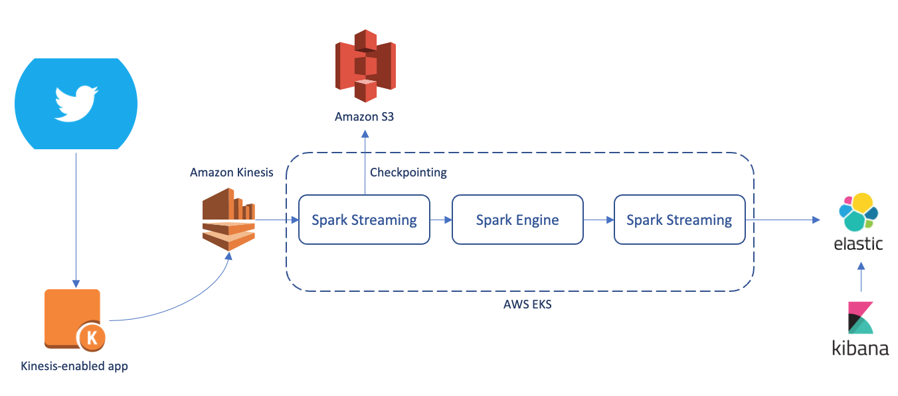

# Spark Sentiment Analysis

This repository contains scripts to:

- Build an EKS cluster including Prometheus/Grafana services using Terraform on `Graviton4` instances
- Create a JAR file for sentiment analysis
- Build a Spark Docker container
- Run Spark computations on a stream of Tweets from X

## Requirements

Current setup assumes that Elasticsearch and Kibana services are already deployed and accessible by the Kubernetes cluster.

## Service diagram



## Issues and TODOs

- Utilize Terraform to:
  - [ ] Create a spark service account
  - [ ] Deploy Elasticsearch and Kibana as services within the cluster
  - [ ] Set up a Docker registry for the Spark image
  
- [ ] Resolve the issue of the streaming ML inference running on a single core (see the related section)

## Build EKS cluster using Terraform

Ensure that the Terraform executable is downloaded. Update `eks/variables.tf` to configure the necessary variables, then execute the following commands:

```bash
cd eks
terraform init
terraform apply --auto-approve
```

The Terraform script incorporates concepts from these two repositories [[1](https://github.com/hashicorp/learn-terraform-provision-eks-cluster)][[2](https://github.com/DNXLabs/terraform-aws-eks-grafana-prometheus)]. It labels executor and Prometheus nodes differently, ensuring that Prometheus and Grafana services (excluding exporters) are installed exclusively on the Prometheus-specific nodes.

Run the following commands to generate the configuration file and create the spark service account, which is necessary for the driver to spawn executors on the cluster.:

```bash
aws eks --region $(terraform output -raw region) update-kubeconfig --name $(terraform output -raw cluster_name) --profile <AWS_PROFILE_NAME>

kubectl create serviceaccount spark
kubectl create clusterrolebinding spark-role --clusterrole=edit --serviceaccount=default:spark --namespace=default
```

## Build sentiment analysis JAR file

Requirements:

- sbt package manager needs to be installed.

Running the following command results in creating a JAR file `sentiment_analysis/target/scala-2.13/bigdata-assembly-0.1.jar`:

```bash
# install JAVA and sbt
sudo apt update

# TODO: install specific version supported bt Spark
sydu apt install default-jre

# TODO: install specific version that works for the project
sudo apt-get install apt-transport-https curl gnupg -yqq
echo "deb https://repo.scala-sbt.org/scalasbt/debian all main" | sudo tee /etc/apt/sources.list.d/sbt.list
echo "deb https://repo.scala-sbt.org/scalasbt/debian /" | sudo tee /etc/apt/sources.list.d/sbt_old.list
curl -sL "https://keyserver.ubuntu.com/pks/lookup?op=get&search=0x2EE0EA64E40A89B84B2DF73499E82A75642AC823" | sudo -H gpg --no-default-keyring --keyring gnupg-ring:/etc/apt/trusted.gpg.d/scalasbt-release.gpg --import
sudo chmod 644 /etc/apt/trusted.gpg.d/scalasbt-release.gpg
sudo apt-get update
sudo apt-get install sbt

cd sentiment_analysis
sbt assembly
```

## Create Spark docker container image

The Spark repository contains a script to build the Docker image needed for running inside the Kubernetes cluster. Execute the script on an Arm machine, or use cross-compilation to build the image specifically for AArch64. First, create a repository on Amazon Elastic Container Registry, and then run the following commands:

```bash
# assuming that the work directory is the current directory
git clone https://github.com/apache/spark.git
cd spark
git checkout v3.4.3

cp ../sentiment_analysis/target/scala-2.13/bigdata-assembly-0.1.jar jars/
aws ecr get-login-password --region <REGION> --profile <AWS_PROFILE> | docker login --username AWS --password-stdin 532275579171.dkr.ecr.us-east-1.amazonaws.com
bin/docker-image-tool.sh -r <Repository Address> -t sentiment-analysis build
bin/docker-image-tool.sh -r <Repository Address> -t sentiment-analysis push
```

## Run Spark computation on the cluster

Now, execute the `spark-submit` command within the Spark folder to deploy the application. The following commands will run the application with two executors, each with 12 cores, and allocate 24GB of memory for both the executors and driver pods.

```bash
export MASTER_ADDRESS=<K8S_MASTER_ADDRESS>
export ES_ADDRESS=<IP_ADDRESS_OF_ELASTICS_SEARCH>
export CHECKPOINT_BUCKET=<BUCKET_NAME>
export EKS_ADDRESS=<EKS_REGISTERY_ADDRESS>

bin/spark-submit \
      --class bigdata.SentimentAnalysis \
      --master k8s://$MASTER_ADDRESS:443 \
      --deploy-mode cluster \
      --conf spark.executor.instances=2 \
      --conf spark.kubernetes.container.image=532275579171.dkr.ecr.us-east-1.amazonaws.com/spark:sentiment-analysis \
      --conf spark.kubernetes.driver.pod.name="spark-twitter" \
      --conf spark.kubernetes.namespace=default \
      --conf spark.kubernetes.authenticate.driver.serviceAccountName=spark \
      --conf spark.driver.extraJavaOptions="-DES_NODES=4$ES_ADDRESS -DCHECKPOINT_LOCATION=s3a://$CHECKPOINT_BUCKET/checkpoints/" \
      --conf spark.executor.extraJavaOptions="-DES_NODES=$ES_ADDRESS -DCHECKPOINT_LOCATION=s3a://$CHECKPOINT_BUCKET/checkpoints/" \
      --conf spark.executor.cores=12 \
      --conf spark.driver.cores=12 \
      --conf spark.driver.memory=24g \
      --conf spark.executor.memory=24g \
      --conf spark.memory.fraction=0.8 \
      --name sparkTwitter \
      local:///opt/spark/jars/bigdata-assembly-0.1.jar
```

## Check application status

Use kubectl to retrieve information about the pods in the Kubernetes cluster, including details about the driver and executors:

```bash
kubectl get pods
NAME                                        READY   STATUS    RESTARTS   AGE
sentimentanalysis-346f22932b484903-exec-1   1/1     Running   0          7h52m
sentimentanalysis-346f22932b484903-exec-2   1/1     Running   0          7h52m
spark-twitter                               1/1     Running   0          7h53m
```

Grafana dashboards can be used to analyze the resource usage of the application within the cluster. To access Grafana, use the kubectl port-forward capability:

```bash
kubectl port-forward service/prometheus-grafana 3000:80 -n prometheus
```

## Example: X tweets sentiment analysis

Sogn up for a Basic or Pro [developer account](https://developer.x.com/en/docs/x-api/getting-started/getting-access-to-the-x-api), create a bearer token, and run

```bash
export BEARER_TOKEN=<BEARED_TOKEN_FROM_X>
python3 scripts/xapi_tweets.py
```

Import `dashboards/sentiment_dashboard.ndjson` into Kibana to monitor the tweets, sentiments, and  statistics.

## Resource usage of the pipeline

The executors consume a significant amount of memory during inference (on Kubernetes cluster), but only a single CPU core is utilized for processing the stream of input data:


